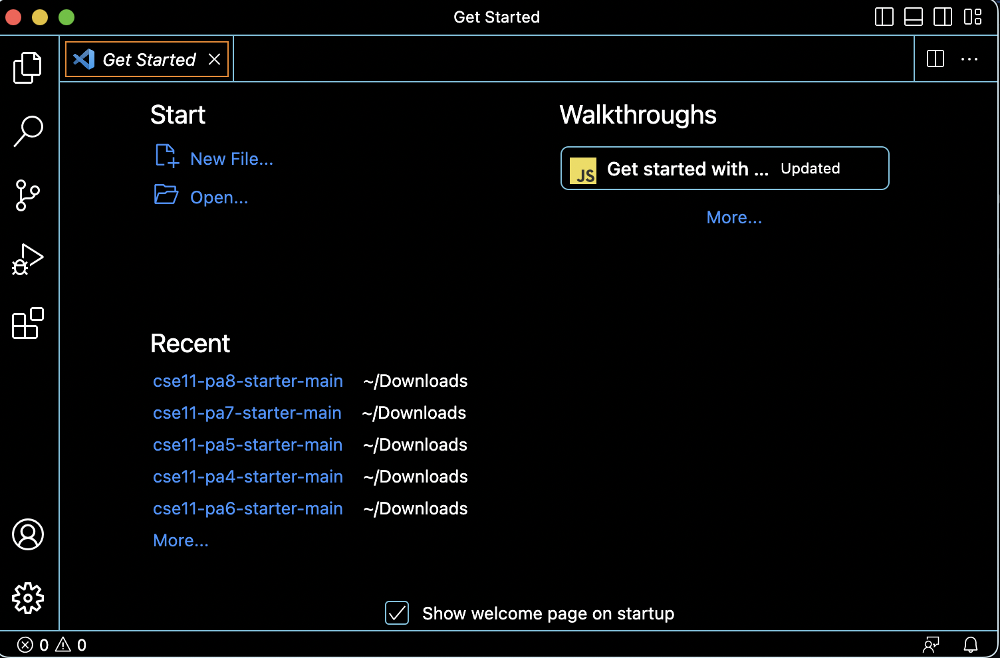
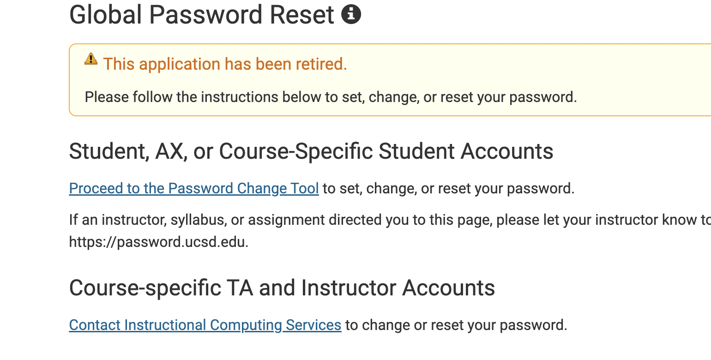

# Remote access and FileSystem tutorial
Hello incoming 15l UCSD students! During lab1 many students including myself had to do three things:
1. Install VScode
2. Remotely connect
3. Figure out how to use commands

In this tutorial, I'm to take you through this process so you're experience is smooth and simple. 

---
# Installing VScode
First, head over to the Visual Studio [website](https://code.visualstudio.com/), and download the version that is compatible with your device (macOS, 
windows, etc).

When it is installed, a window should open up a home page that looks similar to this: 

You're all set with installing VScode, you can start coding all your fancy projects, but now we're going to move on!

---
# Remotely connecting
This process is gonna be a little more extensive so pay close attention:
First, you're going to look up your course specific CSE15l account [here](https://sdacs.ucsd.edu/~icc/index.php).

1. Enter your pid and username
2. Click on the account that begins with cs15l

3. Then click on change password just under your account name
4. Then click the link right under Course-specific TA and Instructor accounts.

6. Change your password and congrats! You have your new account.
