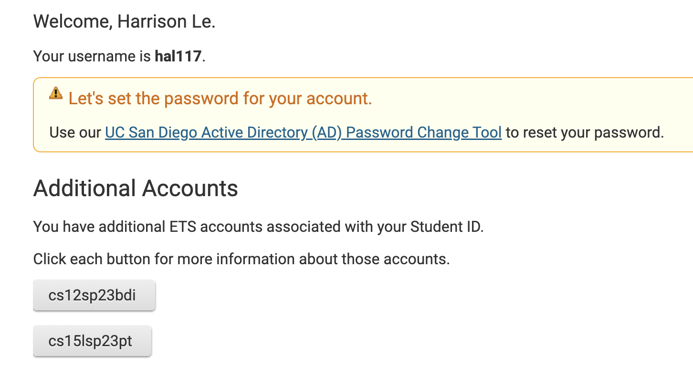

# Remote access and FileSystem tutorial
Hello incoming 15l UCSD students! During lab1 many students including myself had to do three things:
1. Install VScode
2. Remotely connect
3. Figure out how to use commands

In this tutorial, I'm to take you through this process so you're experience is smooth and simple. 

---
# Installing VScode
First, head over to the Visual Studio [website](https://code.visualstudio.com/), and download the version that is compatible with your device (macOS, 
windows, etc).

When it is installed, a window should open up a home page that looks similar to this: 


You're all set with installing VScode, you can start coding all your fancy projects, but now we're going to move on!

---
# Remotely connecting
This process is gonna be a little more extensive so pay close attention:
First, you're going to look up your course specific CSE15l account [here](https://sdacs.ucsd.edu/~icc/index.php).

1. Enter your pid and username
2. Click on the account that begins with cs15l

3. Then click on change password just under your account name
4. Then click the link right under Course-specific TA and Instructor accounts.

6. Change your password and congrats! You have your new account!

Now we will use that account in our VScode terminal to connect to remote computers over the internet to do work.
If you are on windows you will need to install git which you can do through [here](https://gitforwindows.org/).
Then, follow these [steps](https://stackoverflow.com/questions/42606837/how-do-i-use-bash-on-windows-from-the-visual-studio-code-integrated-terminal/50527994#50527994) to set your default terminal to use the new git bash we just installed. 


You will open your terminal and use ssh. In the terminal, type `ssh cs15lsp23zz@ieng6.ucsd.edu` but change the phrase after 23 (in this case zz) to whatever your course account is (it should be two letters). Then enter your password. (you will not be able to see your password for security reasons so type it out carefully and then click enter). This should get your account running and you will be remotely connected!

---
# Running some commands
Here comes the fun part! After opening the terminal in VScode and sshing, try some of these commands and see what they do.
```
1. $ cd ~
2. $ cd
3. $ ls -lat
4. $ ls -a
5. $ ls <directory> where <directory> is /home/linux/ieng6/cs15lwi23/cs15lwi23abc, where the abc is one of the other group members’ username
6. $ cp /home/linux/ieng6/cs15lwi23/public/hello.txt ~/
7. $ cat /home/linux/ieng6/cs15lwi23/public/hello.txt
```
(DO NOT include $ when writing out the commands, the $ symbol is just to signify a line of code). For example, `cd` changes the directory to the one of your choosing and while command `cat` prints out the contents of the file you run. Or `ls -a` which shows hidden files and directories in the current directory. After trying out these commands, write down and make note of what each command does. For a more concrete explanation and example, go to the next page. 

For example when I use `ls -lat` in the terminal:

 
Here, the command `ls -lat` lists all the directories and file names by sorting the dates in order. 
---


This concludes a quick little tutorial for installing VScode, setting up remote access, and showing some of the commands you can use. To log out, you can use Ctrl-D or run the command `exit`. Hope it was helpful!
