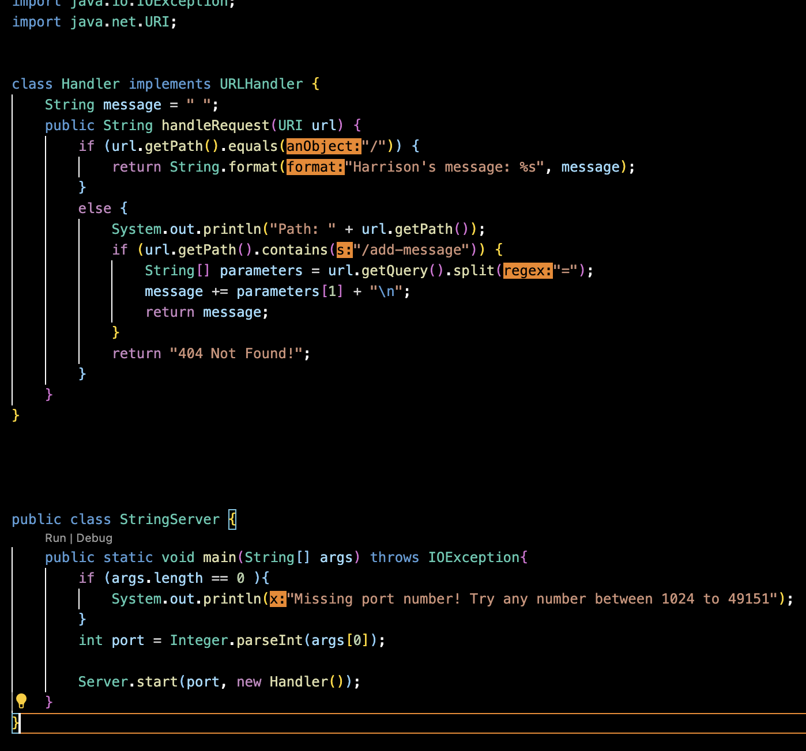
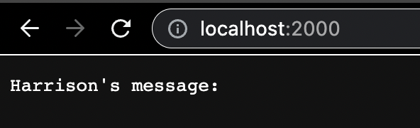
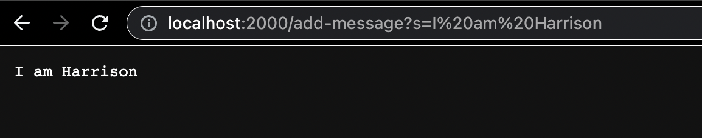
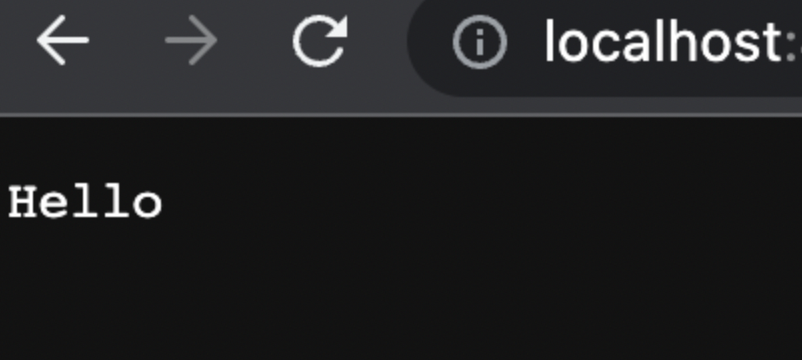
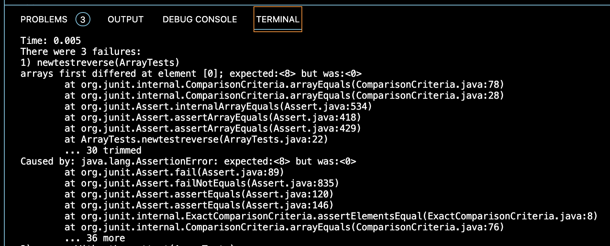

CSE15l Lab Report 2
---
In the past two labs, students were taught how to create and implement a String Server which takes a String and prints it on a local website. We also learned how to debug programs and fix them using jUnit tests. 

---
Part 1 Creating a Web Server called `String Server`
---
I created a new file `StringServer.java` in the wavelet folder from the lab in week 2. Using the knowledge I gained from lab, I created two classes, `Handler` and `StringServer`. The code looks like this. 



In the code, the `handleRequest` class takes a URI object as an argument and returns a string response. If there is no path, then the code will just print "Harrison's message:" because there is no string. If there is a path and there is a string after "=", then that string will be printed. The `StringServer` class checks whether or not any arguments have been added and if not, asks for a port number. Then it starts the server and handles any new information through the `Handler` method.

The next step is to launch the server using `javac StringServer.java` and `java StringServer (insert any port number)`. You should get a page that looks like this. 




Now that you have your webiste up and running, we can add `/add-message?s=<string>` to the end of the url or query.
For example:
`
-http://localhost:4000/add-message?s=hello
-http://localhost:4000/add-message?s=I am Harrison
`



In both images, the handleRequest method was called and took in the URL as an argument and satisfied the requirement of including the "add-message" strinng, so it printed out the string that came after, in both cases `Hello` and `I am Harrison`.

---
## Part 2 Debugging
---

In the third lab we focused on debugging methods using JUnit tests. We debugged, reported the symptoms, and then changed the code in order to fix it. 

For example in the ArrayExamples file there was an error in the `reversed()` method. 


```
static int[] reversed(int[] arr) {
    int[] newArray = new int[arr.length];
    for(int i = 0; i < arr.length; i += 1) {
      arr[i] = newArray[arr.length - i - 1];
    }
    return arr;
}
```


Using a JUnit test with a failure inducing input, the error that I got was:


```
@Test
  public void newtestreverse(){
    int[] input1 = { 10, 9, 8};
    assertArrayEquals(new int[]{8, 9, 10}, ArrayExamples.reversed(input1) );
  }
 ```
 
 
 
 
 
An input that doesn't produce a failure is:


```
 @Test
  public void testReversed() {
    int[] input1 = { };
    assertArrayEquals(new int[]{ }, ArrayExamples.reversed(input1));
  }
 ```
 
The purpose of `reversed()` was to copy the elements of the input array into a new array in reverse order. However, in line ` arr[i] = newArray[arr.length - i - 1]; ` is trying to access elements of the new array newArray to assign them to elements of the input array arr, which is the opposite of what should be happening. This is what the corrected version of the code should look like. 

```
static int[] reversed(int[] arr) {
    int[] newArray = new int[arr.length];
    for(int i = 0; i < arr.length; i += 1) {
      newArray[i] = arr[arr.length - i - 1];
    }
    return newArray;
}
```

This fixes the issue because it correctly assigns the elements or arr in reverse to newArray.

---
# Final thoughts
---

I learned many things in labs 2 and 3, but the thing that was most interesting to me was learning how to create a program that takes in a url and produce a server. Although it was difficult for me to wrap my head around it at first, I was able to understand it which increased my confidence in understanding programming concepts. 
 
