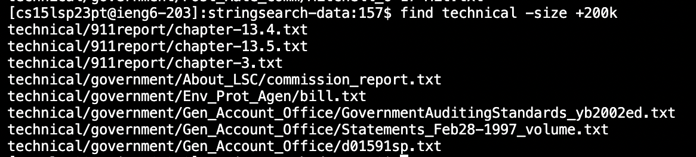
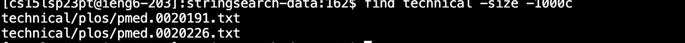
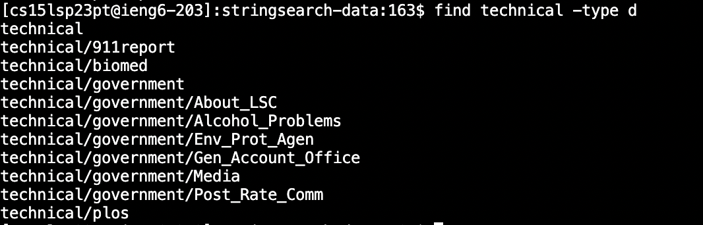
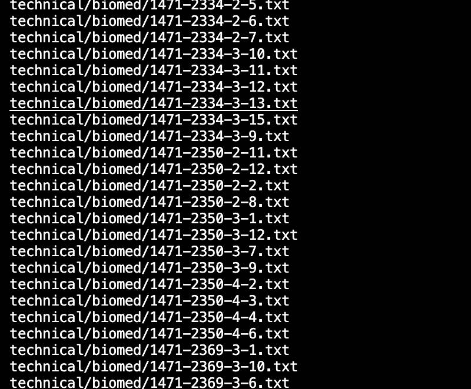

# Lab Report 3 by: Harrison Le
---
# Reasearching Commands `find`
---
The `find` command is a useful command that allows the user to search for various files within a directory or folder. This command proves its versatility when being provided
with large repositories and want to find a specific file immediately. There are many different ways you can use this command and many different command-line options to help you with that
being `-name`, `type`, `-path`, `-size`. 

# Using `-name`
---
When we use `-name` after the `find` command in the terminal, Bash will search for files based on that name or pattern. The command would look something like this.

`$ find <current directory> -name <what you want to find>`

First Example:
`$ find technical -name chapter-1.txt`

Second Example:
`$ find technical -name journal.pbio.0020001.txt`

Looking at the outputs, the command tells us exactly where the file is, making our lives much easier. For more information on this command, click [HERE](https://linuxhostsupport.com/blog/how-to-search-files-on-the-linux-terminal/#:~:text=The%20find%20command%20allows%20you%20to%20search%20a%20specific%20file,that%20you%20want%20to%20search.&text=You%20can%20use%20the%20following,f%20%E2%80%93%20regular%20file).

---
# Using `-size`
---
The `-size` command allows the user to look for every file that is larger than or less than a certain size. This is espescially useful when searching for multiple files of the same size. The command would look something like this. For reference you can measure the size value of files in bytes, kilobytes, megabytes, etc. 

`$ find <current directory> -path <part of path>`

First Example:
`$ find technical -size +200k` (This command finds files that are larger than 200 kilobytes where the k represents the kilobytes).

Second Example:
`$ find technical -size  -1000c` (This command finds files that are smaller than 1000 kilobytes where the c represents the bytes).

Here, we can see the various files that meet the size requiremet that we wanted. I didn't find this command anywhere online, but actually from CHATgpt and found it really interesting and useful!

---
# Using `-type`
---
The `-type` command searches for every file that is referred to the type you weant. If we typed `d` after -type, all the directories or folders would be returned. The command you would use would be:

`$ find <current directory> -type <type you want>` 

First Example:

`$ find technical -type d`

Second Example:

`$ find technical -type f` (searches for type file which ended up filling up the terminal as there were so many)

For more information on this command click [HERE](https://linuxize.com/post/how-to-find-files-in-linux-using-the-command-line/).

---
#Using `-mtime`
---
The `mtime` command allows us to search for files based on their modification time. You can adjust the value to what you desire for example, finding files that have been modified within the last 5 days. The command you would use would look like. 

`$ find <current directory> -mtime <value of days>`

First Example:
`$ find technical -mtime -1` (The -1 represents searching for files modified in the last 1 days)

Second Example:
`$ find technical -mtime +7` (The +7 represents searching for files modified more than 7 days ago)

Here, there is no output because nothing has been modified more than 7 days ago. For more information on this command click [HERE](https://sysaix.com/43-practical-examples-of-linux-find-command)

---

This is Lab Report 3 talking about the various command line options that we can use with the command `find`. I learned a lot about the versatility of this command and the many ways it can be used in making the lives of developers easier. I'm sure there is more to learn and I have only touched the surface. 

