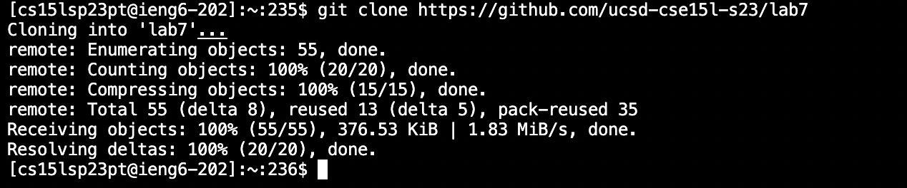
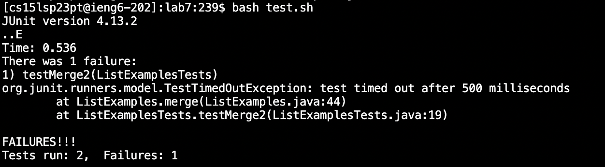
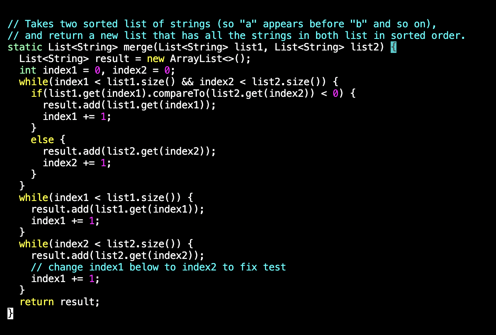
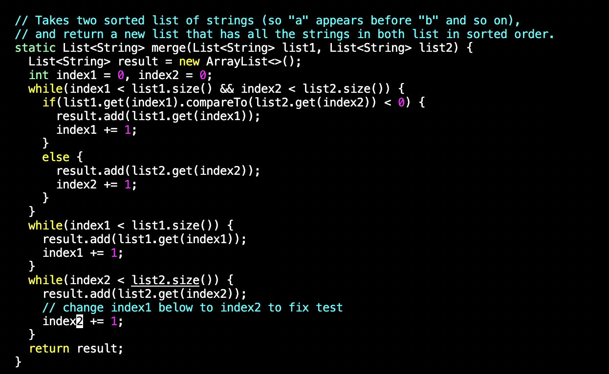
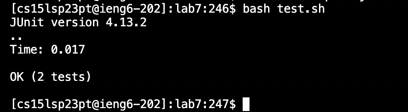
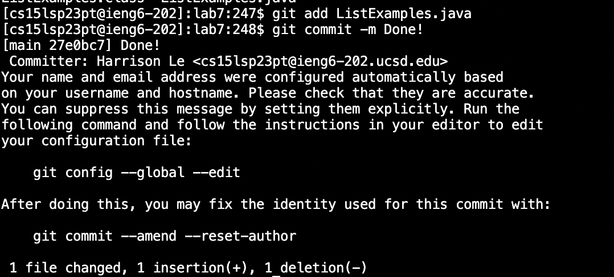

# Lab Report 4 by: Harrison Le
---

In today's lab, we had to see how fast we could edit and compile a file through the terminal using vim. There were a couple of steps to do this and many different ways to speed
up the process.

---
## Step 1: Logging into remote account
The first step is to log into your remote account. So I typed out ssh cs15lsp23pt@ieng6.ucsd.edu and then typed out my password and clicked `<enter>`.

---
## Step 2: Cloning fork of the repository
After you are successfully logged in, type out

`git clone https://github.com/hal117/lab7.git <Enter>`

You should then see something like this.

1. Type out `ls` to check whether lab7 has been successfully clones.
2. If you see lab7, then change directories into it by typing out `cd lab7 <Enter>`.

---
## Step 3: Run the tests demonstrating they fail
Once you have successfully changed directories, you will run J-unit tests to demonstrate that there are tests being failed by typing our `bash test.sh <Enter>`. You should see 
something like this.

---
## Step 4: Editing the code to fix the failing test

After seeing the errors, we are going to have to fix the code through vim. In the terminal type out `vim ListExamples.java <Enter>` to open the file up in vim.
Once inside Vim here are the exact keys that I pressed.
`$ /index1 <Enter> n n n n n n n n n l l l l l r 2 <Esc> :wq`

Original code would look like this

After the fix it would look like this

---
## Step 5: Running the test to demonstrate they succeed

After fixing the code run a J-unit test to determine success by typing out `bash test.sh <Enter>`.

You should get an image that looks like this 

---
## Step 6: Commit and push the changes to Github

To commit the changes, you have to type out `git add ListExamples.java<Enter>` Then `git commit -m Done! <Enter>`.

Finally, push the resulting changes to your repository by typing out `git push origin` and then log in to your github and enter your password.

And there you go you are all set and have successfuly edited, compiled a file, and push the changes to your github repository!
