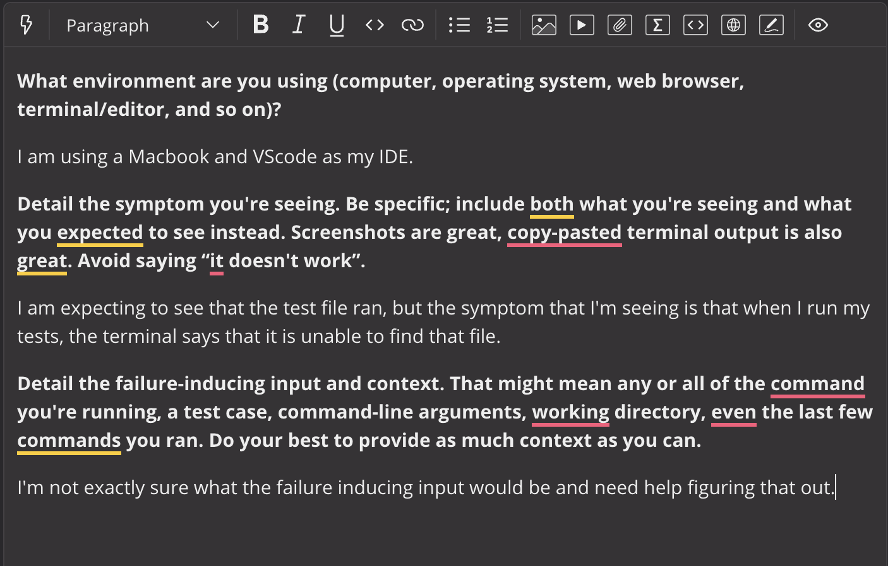
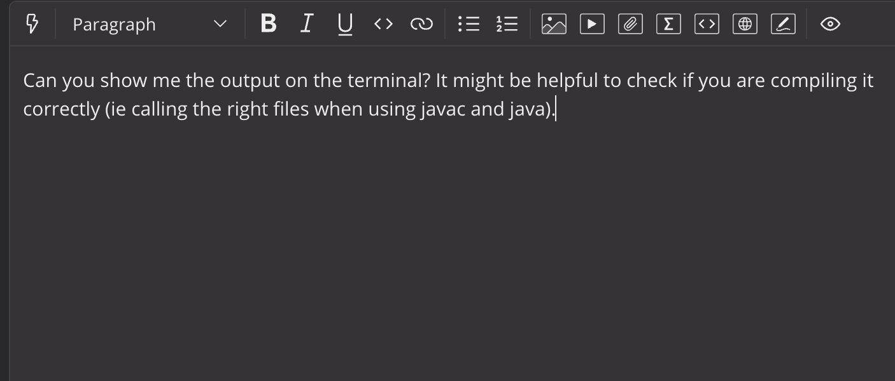
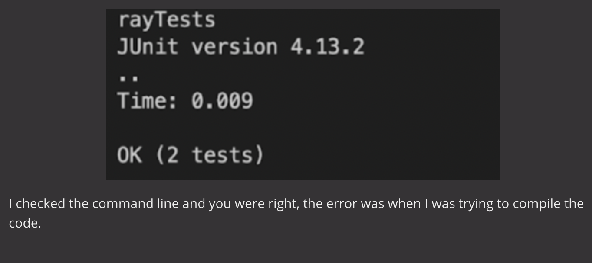

# Lab Report 5 by Harrison Le
---
In this lab, we were tasked with reproducing errors and the best practice to go about debugging them. In this lab report, we are going to be simulating a debugging scenario
as a conversation on edstem between a TA and student. 

---
# An edstem post from a student descrbing the bugs that they are encountering.

---

# Response from TA

---

# Response from the student after trying that out

---

The error was caused due to compiling the ArrayTest files wrong. The error was that in the second line, they put ArrayTests.java instead of ArrayTests. 
This is a common error, but one should remember that when you are compiling it for the first time (using javac), then you should put the “.java”,
but when you are actually running it (using java), then you should just put the file name.

---
# Reflection

Someting that I learned from this quarter that I hadn't know before that I found extremely interesting were bash scripts and how they could be used in gradescope to grade
our assignments by running our code through tests. This was because I was able to see how it was applicable in the real world which made me much more interested in learning
about it. I also enjoyed learning about various linux commmands such as grep as I was able to see how they could make the lives of programmers much easier. This course was 
fun and I learned a lot. My debugging skills have definetly improved and my knowledge on the various commands that exist in the programming world. 
